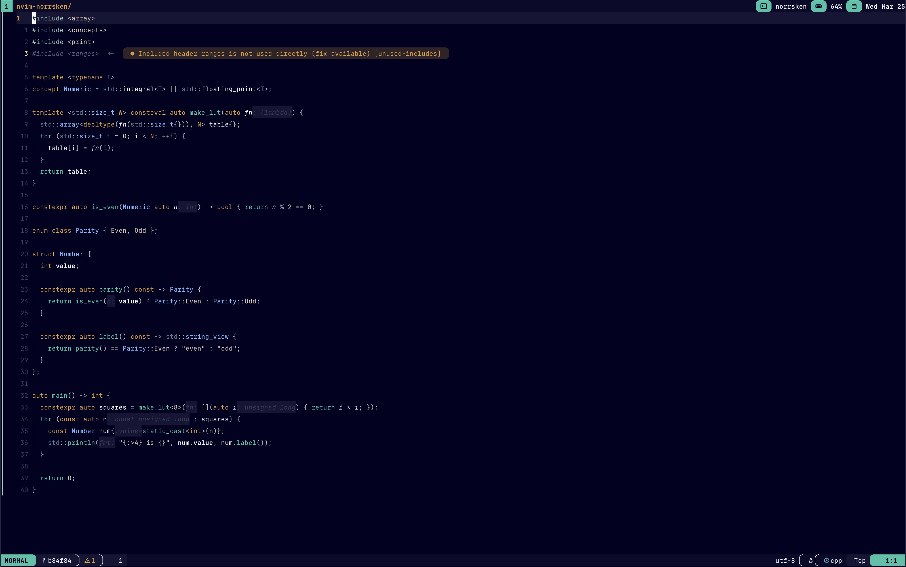

# nvim-norrsken



A dark Neovim colorscheme built with [lush.nvim](https://github.com/rktjmp/lush.nvim).

The color palette is built around a deep navy-black background with a deliberate semantic system. Each color maps to a meaningful category. Keywords are warm amber, execution flow is teal, types are blue, values are tan. The goal is low visual noise with high information density.

## Install

Requires [lush.nvim](https://github.com/rktjmp/lush.nvim) (declared automatically as a lazy.nvim dependency).

```lua
{ "LarssonMartin1998/nvim-norrsken" }
```

```lua
require("norrsken").setup({
  integrations = {
    blink                   = true,
    noice                   = true,
    incline                 = true,
    neogit                  = true,
    tiny_inline_diagnostics = true,
  },
})
```

All integrations are opt-in and disabled by default. `setup()` applies the colorscheme. You can also use `colorscheme norrsken` directly without calling `setup()` if you don't need any integrations.

## Lualine

The lualine theme is not auto-applied. Pass it explicitly in your lualine setup:

```lua
require("lualine").setup({ options = { theme = require("norrsken.integrations.lualine") } })
```
